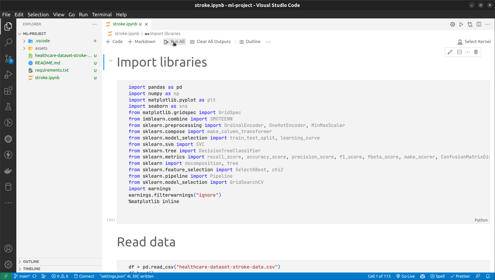

# Predicting Stroke Risk Using Machine Learning Classification Algorithms <!-- omit in toc -->

Authors: **Nguyen Tuan Hiep, Le Minh Duc**

## Table of Contents <!-- omit in toc -->

- [1. Description](#1-description)
- [2. Running Project](#2-running-project)
- [3. References](#3-references)

## 1. Description

Stroke is a major cause of death and disability worldwide, with a high economic impact on healthcare systems. According to World Stroke Organization, stroke has already reached epidemic proportions. It is estimated that globally 1 in 4 adults over the age of 25 will have a stroke in their lifetime. 12.2 million people worldwide will have their first stroke this year and 6.5 million will die as a result. Over 110 million people in the world have experienced stroke.

The goal of this project is to use machine learning algorithms to predict stroke risk based on several attributes such as: gender, age, hypertension, heart disease, married status, work type, residence type, average glucose level, body mass index, and smoking status.

In this project, two supervised binary classification ML models, `Decision Tree` and `Support Vector Machine`, are used to predict the risk of stroke based on the features aforementioned since they are suitable for binary classification problems.

## 2. Running Project

Clone the repository if you haven't had it on your local machine:

```shell
git clone https://github.com/nguyen-tuan-hiep/ml-project.git
```

Change directory to the project:

```shell
cd ml-project
```

Install the dependencies:

```shell
pip install -U -r requirements.txt
```

We highly recommend using VSCode to run the project. You can install the [Python extension](https://marketplace.visualstudio.com/items?itemName=ms-python.python) and the [Jupyter extension](https://marketplace.visualstudio.com/items?itemName=ms-toolsai.jupyter) to run the project.



Alternatively, you can run the project using Jupyter Notebook:

```shell
jupyter notebook
```

## 3. References

[1] [Stroke Prediction Dataset on Kaggle](https://www.kaggle.com/datasets/fedesoriano/stroke-prediction-dataset)
